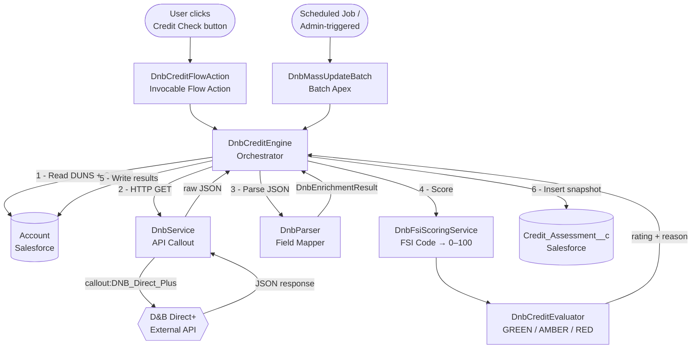

# D&B Credit Engine — Integration Guide

**Audience:** Finance team (business), Salesforce admins, and on-boarding developers  
**Last updated:** 2026-06-26 (Phase 2)  
**Author:** Sidharrth Nandhakumar

---

## Table of Contents

1. [System Overview](#section-1--system-overview)
2. [File Map](#section-2--file-map)
3. [The D&B API Call (DnbService)](#section-3--the-db-api-call-dnbservice-deep-dive)
4. [Field Mapping (DnbParser)](#section-4--field-mapping-dnbparser-deep-dive)
5. [Scoring Logic](#section-5--scoring-logic)
6. [Step-by-Step: Adding a New Field](#section-6--step-by-step-adding-a-new-field)
7. [Running a Credit Check](#section-7--running-a-credit-check)
8. [Troubleshooting](#section-8--troubleshooting)
9. [Testing](#section-9--testing)

---

## Section 1 — System Overview

### What This System Does

The D&B Credit Engine connects Salesforce to the Dun & Bradstreet (D&B) Direct+ API. Given a company's DUNS number on an Account record, it fetches financial risk data, computes an internal credit rating (GREEN / AMBER / RED), and writes the results back to the Account and a permanent Credit Assessment snapshot record.

There are two ways to trigger a credit check:

- **On Demand** — a Salesforce Flow calls `DnbCreditFlowAction` for a single account (e.g. from a button on the Account page).
- **Mass Update** — `DnbMassUpdateBatch` runs on a schedule and refreshes all accounts with a DUNS number that haven't been updated in 30 days.

Both paths converge on `DnbCreditEngine`, which orchestrates the entire process.

### End-to-End Architecture



### Key Data Objects

| Object | Purpose |
|---|---|
| `Account` | Source of the DUNS number; receives scoring results and company info fields |
| `Credit_Assessment__c` | Immutable snapshot of every credit check run; never overwritten |
| `Dnb_Block_Group__mdt` | Custom Metadata — controls which D&B data blocks are requested |
| `DnbEnrichmentResult` | Apex data class — in-memory container passed between all classes |

---

## Section 2 — File Map

| File Name | Role | When It Runs | Touches These Salesforce Objects |
|---|---|---|---|
| `DnbCreditFlowAction.cls` | Invocable action; Salesforce Flow entry point | When a Flow calls it (on-demand per account) | — (delegates to Engine) |
| `DnbCreditFlowRequest.cls` | Input data class for `DnbCreditFlowAction` | Compiled with the action class | — |
| `DnbCreditEngine.cls` | Orchestrator; queries Account, calls Service, calls Parser, calls Evaluator, writes results | Called by FlowAction or MassUpdateBatch | `Account`, `Credit_Assessment__c` |
| `DnbService.cls` | Makes the HTTP callout to D&B Direct+ API | Called by DnbCreditEngine | — (HTTP only) |
| `DnbParser.cls` | Deserializes the D&B JSON into a `DnbEnrichmentResult` | Called by DnbCreditEngine after API response | — (in-memory only) |
| `DnbEnrichmentResult.cls` | Data transfer object — holds all parsed fields + evaluator output | Instantiated by DnbParser; passed to DnbCreditEvaluator and DnbCreditEngine | — |
| `DnbFsiScoringService.cls` | Maps a D&B Financial Strength Indicator code (e.g. "4A") to a numeric 0–100 score | Called by DnbCreditEvaluator | — |
| `DnbCreditEvaluator.cls` | Computes weighted composite score; assigns GREEN/AMBER/RED rating | Called by DnbCreditEngine | — (writes to DnbEnrichmentResult) |
| `DnbMassUpdateBatch.cls` | Batch job; queries stale accounts and runs Engine on each | Scheduled or triggered manually | `Account`, `Credit_Assessment__c` |
| `DnbMassUpdateScheduler.cls` | Schedulable wrapper; checks for already-running batch before launching | Runs on cron schedule | — |
| `DnbMassUpdateLauncher.cls` | Invocable wrapper to trigger mass update from a Flow | Called from a Flow | — |
| `DnbServiceTest.cls` | Tests HTTP callout, DUNS validation, Germany endpoint params | Test execution only | — |
| `DnbParserTest.cls` | Tests JSON parsing for all country scenarios | Test execution only | — |
| `DnbCreditEngineTest.cls` | Integration tests — Account DML, Credit Assessment creation, end-to-end flow | Test execution only | `Account`, `Credit_Assessment__c` |
| `DnbFsiScoringServiceTest.cls` | Tests all FSI code mappings | Test execution only | — |
| `DnbCreditEvaluatorTest.cls` | Tests all rating bands, boundary conditions, null guards | Test execution only | — |
| `DnbCreditFlowActionTest.cls` | Tests Flow action wrapper, error surfacing | Test execution only | `Account`, `Credit_Assessment__c` |
| `DnbMassUpdateBatchTest.cls` | Tests batch query, success/failure paths, stateful counters | Test execution only | `Account`, `Credit_Assessment__c` |
| `DnbEnrichmentResultTest.cls` | Tests DnbEnrichmentResult defaults | Test execution only | — |

---

## Section 3 — The D&B API Call (DnbService Deep Dive)

### Method Signature

```apex
public static String fetchCompanyData(String duns, String blockGroupName, String countryCode)
```

- **`duns`** — the 9-digit D&B identifier from `Account.DUNs_Number__c`. Blank or null throws `IllegalArgumentException`.
- **`blockGroupName`** — the `DeveloperName` of a `Dnb_Block_Group__mdt` record. Controls which data blocks are requested.
- **`countryCode`** — the ISO 2-letter country code from `Account.BillingCountryCode`. Used only to detect German companies (see below).
- **Returns** — the raw JSON response body as a `String`.

### Named Credential Setup

The class never handles tokens or secrets. Authentication is entirely delegated to the Salesforce Named Credential `DNB_Direct_Plus`.

**Where to find it in Setup:**
> Setup → Security → Named Credentials → **DNB_Direct_Plus**

The endpoint used in the code is:
```apex
String endpoint = 'callout:DNB_Direct_Plus/v1/data/duns/' +
                  duns +
                  '?blockIDs=' +
                  EncodingUtil.urlEncode(blockIds, 'UTF-8');
```

The Named Credential stores the D&B base URL and the OAuth 2.0 client credentials. If authentication expires, re-enter the client ID and secret in the Named Credential record — no code change needed.

### Dnb_Block_Group__mdt — What It Is and How to Find It

`Dnb_Block_Group__mdt` is a **Custom Metadata Type** that controls which data blocks are requested from the D&B API. Think of it as a configuration table: you add a row to request more data without changing any code.

**Where to find it in Setup:**
> Setup → Custom Code → Custom Metadata Types → **Dnb Block Group** → Manage Records

**Field meanings:**

| Field | API Name | What It Does |
|---|---|---|
| Label | `MasterLabel` | Human-readable name |
| Developer Name | `DeveloperName` | Used in code to look up the record |
| Active | `Active__c` | If unchecked, the record is ignored and an error is thrown |
| Block IDs | `Block_IDs__c` | Comma-separated D&B block identifiers, e.g. `companyinfo,financialstrengthinsight,eventfilings` |
| Scenario Key | `Scenario_Key__c` | The key passed from DnbCreditEngine to look up this record (e.g. `ON_DEMAND`, `MASS_UPDATE`) |

The batch job always passes `'MASS_UPDATE'` as the scenario key (see `DnbMassUpdateBatch.cls` line 41). The Flow action passes whatever `scenarioKey` is set in the Flow, typically `'ON_DEMAND'`.

### Germany-Specific Endpoint

The D&B regional data agreement for Germany requires three extra query parameters. The conditional logic in `DnbService.cls` (lines 42–48):

```apex
// Germany requires extra query params per D&B's regional data agreement
if (countryCode != null && countryCode == 'DE') {
    endpoint +=
        '&tradeUp=hq' +
        '&customerReference=' +
        EncodingUtil.urlEncode('SF-' + duns, 'UTF-8') +
        '&orderReason=6332';
}
```

All other countries hit the plain endpoint with only `blockIDs`. Germany gets `tradeUp=hq`, a `customerReference` prefixed with `SF-`, and `orderReason=6332`.

### Real D&B API Response Examples

#### Standard Global Company (SuccessMock)

This is what a successful response looks like for a typical company. Taken from `DnbCreditEngineTest.cls`:

```json
{
  "transactionDetail": {
    "transactionID": "TXN-185520819-001"
  },
  "organization": {
    "duns": "185520819",
    "primaryName": "Acme Corporation",
    "countryISOAlpha2Code": "US",
    "legalEvents": {
      "hasOpenLiens": false,
      "hasOpenJudgments": false,
      "hasOpenBankruptcy": false
    },
    "dnbAssessment": {
      "failureScore": {
        "nationalPercentile": 100,
        "classScoreDescription": "Very low risk of financial stress"
      },
      "delinquencyScore": {
        "nationalPercentile": 100,
        "classScoreDescription": "Very low risk of payment delinquency"
      },
      "standardRating": {
        "financialStrength": "5A",
        "rating": "1",
        "ratingReason": [
          {"description": "Strong financial profile"},
          {"description": "Active trading record"}
        ]
      },
      "creditLimitRecommendation": {
        "maximumRecommendedLimit": {
          "value": 250000,
          "currency": "USD"
        }
      }
    }
  }
}
```

#### German Company (GermanCompanyMock)

German companies often return `ratingOverrideReasons` instead of `ratingReason`, and an empty `delinquencyScore` block. Taken from `DnbCreditEngineTest.cls`:

```json
{
  "transactionDetail": {
    "transactionID": "TXN-332716757-001"
  },
  "organization": {
    "duns": "332716757",
    "primaryName": "DEV Systemtechnik GmbH",
    "countryISOAlpha2Code": "DE",
    "legalEvents": {
      "hasOpenLiens": false,
      "hasOpenJudgments": false,
      "hasOpenBankruptcy": false
    },
    "dnbAssessment": {
      "failureScore": {
        "nationalPercentile": 0,
        "classScoreDescription": null,
        "scoreModel": {"description": "DE35744"}
      },
      "delinquencyScore": {},
      "standardRating": {
        "financialStrength": "BB",
        "rating": "BB4",
        "ratingReason": [],
        "ratingOverrideReasons": [
          {"description": "Events - Serious legal events or criminal proceedings"}
        ]
      },
      "nordicAAARating": {},
      "creditLimitRecommendation": {}
    }
  }
}
```

#### Nordic Company — Norway (NordicCompanyMock)

Nordic companies use `nordicAAARating` instead of `standardRating`, have an empty `delinquencyScore` block, and the failure score description falls back to `scoreModel.description`. Taken from `DnbCreditEngineTest.cls`:

```json
{
  "transactionDetail": {
    "transactionID": "TXN-345146201-001"
  },
  "organization": {
    "duns": "345146201",
    "primaryName": "Lyse Tele AS",
    "countryISOAlpha2Code": "NO",
    "legalEvents": {
      "hasOpenLiens": false,
      "hasOpenJudgments": true,
      "hasOpenBankruptcy": false
    },
    "dnbAssessment": {
      "failureScore": {
        "nationalPercentile": 70,
        "classScoreDescription": null,
        "scoreModel": {"description": "NO36021"}
      },
      "delinquencyScore": {},
      "standardRating": {
        "financialStrength": "N",
        "rating": "N2",
        "ratingReason": []
      },
      "nordicAAARating": {
        "rating": "A2",
        "financialStrength": {"description": "A"},
        "riskSegment": {"description": "2"}
      },
      "creditLimitRecommendation": {
        "maximumRecommendedLimit": {
          "value": 202700000,
          "currency": "NOK"
        }
      }
    }
  }
}
```

---

## Section 4 — Field Mapping (DnbParser Deep Dive)

`DnbParser.parse(jsonString)` deserializes the raw JSON into a `DnbEnrichmentResult` object. Every field mapped is listed below, extracted directly from `DnbParser.cls` and `DnbEnrichmentResult.cls`.

### Identity Fields

| D&B JSON Path | `DnbEnrichmentResult` Property | `Credit_Assessment__c` / Account Field |
|---|---|---|
| `organization.duns` | `duns` | `Credit_Assessment__c.DUNS__c` |
| `organization.primaryName` | `companyName` | — (not written to Account or CA) |
| `organization.countryISOAlpha2Code` | `countryCode` | — |
| `transactionDetail.transactionID` | `transactionId` | `Account.DnB_Last_Transaction_ID__c`, `Credit_Assessment__c.DnB_Transaction_Id__c` |

### companyinfo Block

| D&B JSON Path | `DnbEnrichmentResult` Property | Account Field |
|---|---|---|
| `organization.primaryIndustryCode.usSicV4` | `sicCode` | `Account.DnB_SIC_Code__c` |
| `organization.primaryIndustryCode.usSicV4Description` | `sicDescription` | `Account.DnB_SIC_Description__c` |
| `organization.websiteAddress[0].url` | `websiteUrl` | `Account.DnB_Website_URL__c` |
| `organization.websiteAddress[0].domainName` | `websiteDomain` | `Account.DnB_Website_Domain__c` |
| `organization.telephone[0].telephoneNumber` | `telephoneNumber` | `Account.DnB_Telephone_Number__c` |
| `organization.telephone[0].isdCode` | `telephoneIsdCode` | `Account.DnB_Telephone_ISD_Code__c` |
| `organization.legalEntityIdentifier` | `legalEntityIdentifier` | `Account.DnB_Legal_Entity_Identifier__c` |
| `organization.isHighRiskBusiness` | `isHighRiskBusiness` | `Credit_Assessment__c.Is_High_Risk_Business__c` |

> **Note on companyinfo fields:** `DnbCreditEngine` writes these to Account **only if the field is currently blank**. This protects values managed by other systems (e.g. RingLead). If you want to force an overwrite, the blank-check must be removed from `DnbCreditEngine.cls` lines 114–134.

### financialstrengthinsight Block — Failure Score

| D&B JSON Path | `DnbEnrichmentResult` Property | Account / CA Field |
|---|---|---|
| `dnbAssessment.failureScore.classScore` | `failureScoreClass` | `Credit_Assessment__c.Failure_Score_Class__c` |
| `dnbAssessment.failureScore.classScoreDescription` | `failureScoreDescription` | `Account.DnB_Failure_Score_Description__c`, `Credit_Assessment__c.DnB_Failure_Score_Description__c` |
| `dnbAssessment.failureScore.nationalPercentile` | `failureScorePercentile` | `Account.Failure_Score_Percentile__c`, `Credit_Assessment__c.Failure_Score_Percentile__c` |

**Nordic fallback for `failureScoreDescription`:** if `classScoreDescription` is null or blank, the parser reads `failureScore.scoreModel.description` and prefixes it with `"Score model: "`. If that is also blank, it writes `"Failure score description not available"`.

### financialstrengthinsight Block — Delinquency Score

| D&B JSON Path | `DnbEnrichmentResult` Property | Account / CA Field |
|---|---|---|
| `dnbAssessment.delinquencyScore.classScore` | `delinquencyScoreClass` | `Credit_Assessment__c.Delinquency_Score_Class__c` |
| `dnbAssessment.delinquencyScore.nationalPercentile` | `delinquencyScorePercentile` | `Account.Delinquency_Score__c`, `Credit_Assessment__c.Delinquency_Score_Percentile__c` |
| `dnbAssessment.delinquencyScore.classScoreDescription` | `delinquencyScoreDescription` | `Account.DnB_Delinquency_Score_Description__c`, `Credit_Assessment__c.DnB_Delinquency_Score_Description__c` |
| `dnbAssessment.delinquencyScore.scoreOverrideReasons[0].description` | `delinqOverrideReason1` | `Credit_Assessment__c.Delinquency_Override_Reason_1__c` |
| `dnbAssessment.delinquencyScore.scoreOverrideReasons[1].description` | `delinqOverrideReason2` | `Credit_Assessment__c.Delinquency_Override_Reason_2__c` |
| `dnbAssessment.delinquencyScore.scoreOverrideReasons[2].description` | `delinqOverrideReason3` | `Credit_Assessment__c.Delinquency_Override_Reason_3__c` |

**Country default:** if `delinquencyScore` is missing or an empty `{}`, all class/percentile fields default to `0` and the description is set to `"Delinquency score not available for this country"` (Norway, Germany).

### financialstrengthinsight Block — Standard Rating

| D&B JSON Path | `DnbEnrichmentResult` Property | Account / CA Field |
|---|---|---|
| `dnbAssessment.standardRating.financialStrength` | `financialStrength` | `Account.DnB_Financial_Strength__c`, `Credit_Assessment__c.Financial_Strength__c` |
| `dnbAssessment.standardRating.rating` | `compositeScore` | `Account.CCA__c`, `Credit_Assessment__c.Composite_Score__c` |
| `dnbAssessment.standardRating.riskSegment` | `riskSegment` | `Credit_Assessment__c.Risk_Segment__c` |
| `dnbAssessment.standardRating.ratingReason[0].description` | `ratingReason1` | `Credit_Assessment__c.Rating_Reason_1__c` |
| `dnbAssessment.standardRating.ratingReason[1].description` | `ratingReason2` | `Credit_Assessment__c.Rating_Reason_2__c` |
| `dnbAssessment.standardRating.ratingReason[2].description` | `ratingReason3` | `Credit_Assessment__c.Rating_Reason_3__c` |
| `dnbAssessment.standardRating.ratingReason[3].description` | `ratingReason4` | `Credit_Assessment__c.Rating_Reason_4__c` |
| `dnbAssessment.standardRating.ratingReason[4].description` | `ratingReason5` | `Credit_Assessment__c.Rating_Reason_5__c` |
| `dnbAssessment.standardRating.ratingReason[*].description` (joined) | `dnbRatingDescription` | `Account.DnB_Rating_Description__c`, `Credit_Assessment__c.DnB_Rating_Description__c` |
| `dnbAssessment.standardRating.ratingOverrideReasons[*].description` (joined, fallback) | `dnbRatingDescription` | Same fields above |

**Nordic fallback for `financialStrength`:** if `standardRating.financialStrength` is blank or `"NQ"`, the parser reads `nordicAAARating.financialStrength.description`.

**Nordic fallback for `compositeScore`:** if `standardRating.rating` is blank or starts with `"NQ"`, the parser reads `nordicAAARating.rating`.

**Nordic fallback for `dnbRatingDescription`:** if `standardRating.ratingReason` is empty and `standardRating.ratingOverrideReasons` is also empty, the parser reads `nordicAAARating.riskSegment.description` and maps it through the `NORDIC_SEGMENT_LABELS` table:

| `riskSegment.description` value | Mapped label |
|---|---|
| `"1"` | `AAA - Lowest risk` |
| `"2"` | `AA - Low risk` |
| `"3"` | `A - Medium risk` |
| `"4"` | `B - Elevated risk` |
| `"5"` | `C - High risk` |

### financialstrengthinsight Block — Financial Condition

| D&B JSON Path | `DnbEnrichmentResult` Property | CA Field |
|---|---|---|
| `dnbAssessment.financialCondition.dnbCode` | `financialConditionCode` | `Credit_Assessment__c.Financial_Condition_Code__c` |
| `dnbAssessment.financialCondition.description` | `financialConditionDescription` | `Credit_Assessment__c.Financial_Condition_Description__c` |

### financialstrengthinsight Block — Credit Limit

| D&B JSON Path | `DnbEnrichmentResult` Property | Account / CA Field |
|---|---|---|
| `dnbAssessment.creditLimitRecommendation.maximumRecommendedLimit.value` | `creditLimit` | `Account.DnB_Recommended_Maximum_Credit__c` (formatted string), `Credit_Assessment__c.Credit_Limit__c` (numeric) |
| `dnbAssessment.creditLimitRecommendation.maximumRecommendedLimit.currency` | `creditLimitCurrency` | `Account.Recommended_Credit_Currency__c`, `Credit_Assessment__c.Credit_Limit_Currency__c` |

### companyfinancials Block (latestFiscalFinancials)

| D&B JSON Path | `DnbEnrichmentResult` Property | CA Field |
|---|---|---|
| `organization.latestFiscalFinancials.filingDate` | `financialsFilingDate` | `Credit_Assessment__c.Financials_Filing_Date__c` |
| `organization.latestFiscalFinancials.receivedTimestamp` | `financialsReceivedTimestamp` | `Credit_Assessment__c.Financials_Received_Timestamp__c` |
| `organization.latestFiscalFinancials.units` | `financialStatementUnits` | `Credit_Assessment__c.Financial_Statement_Units__c` |
| `organization.latestFiscalFinancials.overview.totalAssets` | `totalAssets` | `Credit_Assessment__c.Total_Assets__c` |
| `organization.latestFiscalFinancials.overview.totalCurrentAssets` | `totalCurrentAssets` | `Credit_Assessment__c.Total_Current_Assets__c` |
| `organization.latestFiscalFinancials.overview.totalCurrentLiabilities` | `totalCurrentLiabilities` | `Credit_Assessment__c.Total_Current_Liabilities__c` |
| `organization.latestFiscalFinancials.overview.totalLiabilities` | `totalLiabilities` | `Credit_Assessment__c.Total_Liabilities__c` |
| `organization.latestFiscalFinancials.overview.totalLiabilitiesEquity` | `totalLiabilitiesEquity` | `Credit_Assessment__c.Total_Liabilities_Equity__c` |
| `organization.latestFiscalFinancials.overview.tangibleNetWorth` | `tangibleNetWorth` | `Credit_Assessment__c.Tangible_Net_Worth__c` |
| `organization.latestFiscalFinancials.overview.capitalStock` | `capitalStock` | `Credit_Assessment__c.Capital_Stock__c` |
| `organization.latestFiscalFinancials.overview.workingCapital` | `workingCapital` | `Credit_Assessment__c.Working_Capital__c` |
| `organization.latestFiscalFinancials.overview.netCurrentAssets` | `netCurrentAssets` | `Credit_Assessment__c.Net_Current_Assets__c` |
| `organization.latestFiscalFinancials.overview.currentRatio` | `currentRatio` | `Credit_Assessment__c.Current_Ratio__c` |
| `organization.latestFiscalFinancials.overview.currentLiabilitiesOverNetWorth` | `currentLiabilitiesOverNetWorth` | `Credit_Assessment__c.Current_Liabilities_Over_Net_Worth__c` |

### eventfilings / Legal Events Block

| D&B JSON Path | `DnbEnrichmentResult` Property | CA Field |
|---|---|---|
| `organization.legalEvents.hasOpenLiens` | `hasOpenLiens` | `Credit_Assessment__c.Has_Open_Liens__c` |
| `organization.legalEvents.hasOpenJudgments` | `hasOpenJudgments` | `Credit_Assessment__c.Has_Open_Judgements__c` |
| `organization.legalEvents.hasOpenBankruptcy` | `hasOpenBankruptcy` | `Credit_Assessment__c.Has_Open_Bankruptcy__c` |
| `organization.legalEvents.hasInsolvency` | `hasInsolvency` | `Credit_Assessment__c.Has_Insolvency__c` |
| `organization.legalEvents.hasJudgments` | `hasJudgments` | `Credit_Assessment__c.Has_Judgments__c` |
| `organization.financingEvents.hasOpenSecuredFilings` | `hasOpenSecuredFilings` | `Credit_Assessment__c.Has_Open_Secured_Filings__c` |
| `organization.financingEvents.hasSecuredFilings` | `hasSecuredFilings` | `Credit_Assessment__c.Has_Secured_Filings__c` |
| `organization.significantEvents.hasCEOChange` | `hasCEOChange` | `Credit_Assessment__c.Has_CEO_Change__c` |

### Evaluator Output Fields (Set by DnbCreditEvaluator, not DnbParser)

| `DnbEnrichmentResult` Property | Account Field | CA Field |
|---|---|---|
| `appearCreditRating` | `Account.Appear_Credit_Rating__c` | `Credit_Assessment__c.Appear_Credit_Rating__c` |
| `ratingReason` | `Account.Appear_Rating_Reason__c`, `Account.DnB_Rating_Reason__c` | `Credit_Assessment__c.Rating_Reason__c` |

---

## Section 5 — Scoring Logic

### Step 1: FSI Code → Numeric Score (DnbFsiScoringService)

The D&B Financial Strength Indicator (FSI) code is a letter-based code that represents a company's net worth bracket. `DnbFsiScoringService.getScore()` maps it to a numeric 0–100 score. The mapping is case-insensitive and trims whitespace.

```apex
public static Decimal getScore(String financialStrength) {
    if (String.isBlank(financialStrength)) {
        return 0;
    }
    String strength = financialStrength.trim().toUpperCase();
    switch on strength {
        when '5A' { return 100; }
        when '4A' { return 95; }
        when '3A' { return 85; }
        when '2A' { return 75; }
        when '1A' { return 65; }
        when 'BA' { return 55; }
        when 'BB' { return 50; }
        when 'CB' { return 45; }
        when 'CC' { return 40; }
        when 'CD' { return 35; }
        when 'DC' { return 30; }
        when 'DD' { return 25; }
        when 'EE' { return 20; }
        when 'FF' { return 15; }
        when 'GG' { return 10; }
        when 'HH' { return 5; }
        when 'N'  { return 3; }   // Negative net worth
        when 'NQ' { return 0; }   // Not qualified
        when '--' { return 0; }   // Not available
        when 'DS' { return 0; }   // Discontinued/special
        when '1R' { return 35; }  // Interim/unaudited balance sheet
        when '2R' { return 20; }  // Interim/unaudited balance sheet
        when else { return 0; }
    }
}
```

### Step 2: Weighted Composite Score (DnbCreditEvaluator)

Three signals are combined with fixed weights:

| Signal | Source | Weight |
|---|---|---|
| Failure Score Percentile | `failureScorePercentile` (0–100) | **45%** |
| Delinquency Score Percentile | `delinquencyScorePercentile` (0–100, defaults to 0 when unavailable) | **30%** |
| FSI Score | `DnbFsiScoringService.getScore(financialStrength)` (0–100) | **25%** |

```apex
Decimal finalScore =
    (failureScore * 0.45) +
    (delinquencyScore * 0.30) +
    (fsiScore * 0.25);
```

**Pre-condition check:** if `failureScorePercentile` is null OR `financialStrength` is blank, the evaluator short-circuits and sets `RED_High_Risk` with reason `"Insufficient DNB financial data"`.

### Step 3: Rating Band Assignment

| `finalScore` Range | Rating | Reason Text |
|---|---|---|
| ≥ 81 | `GREEN_Very_Low_Risk` | `"Very low risk based on weighted DNB score and FSI"` |
| ≥ 61 (and ≤ 80) | `GREEN_Low_Risk` | `"Low risk based on weighted DNB score and FSI"` |
| ≥ 41 (and ≤ 60) | `AMBER_Moderate_Risk` | `"Moderate risk based on weighted DNB score and FSI"` |
| ≥ 21 (and ≤ 40) | `RED_Elevated_Risk` | `"Elevated risk based on weighted DNB score and FSI"` |
| < 21 | `RED_High_Risk` | `"High risk based on weighted DNB score and FSI"` |

**Safety floor (FSI override):** if `fsiScore <= 15` AND the raw `finalScore >= 61`, the evaluator caps the result at `AMBER_Moderate_Risk` with reason `"Weak financial strength limits rating despite score"`. This prevents a company with very weak financials (FSI codes: FF, GG, HH, N, NQ, --, DS) from receiving a GREEN rating solely due to high failure/delinquency percentiles.

```apex
if (fsiScore <= 15 && finalScore >= 61) {
    data.appearCreditRating = 'AMBER_Moderate_Risk';
    data.ratingReason = 'Weak financial strength limits rating despite score';
    return;
}
```

### Worked Example

**Input (Acme Corporation, US):**
- `failureScorePercentile` = 80
- `delinquencyScorePercentile` = 80
- `financialStrength` = `"2A"` → FSI score = 75

**Calculation:**
```
finalScore = (80 × 0.45) + (80 × 0.30) + (75 × 0.25)
           = 36 + 24 + 18.75
           = 78.75
```

**Safety floor check:** FSI score is 75, which is > 15 → no cap applied.

**Band:** 78.75 is ≥ 61 and < 81 → **`GREEN_Low_Risk`**

**Output written to Salesforce:**
- `Account.Appear_Credit_Rating__c` = `GREEN_Low_Risk`
- `Account.DnB_Rating_Reason__c` = `Low risk based on weighted DNB score and FSI`
- `Credit_Assessment__c.Appear_Credit_Rating__c` = `GREEN_Low_Risk`

---

## Section 6 — Step-by-Step: Adding a New Field

This section walks you through adding the `ratingOverrideReason1` and `ratingOverrideReason2` fields as separate Credit Assessment fields. Currently, the parser uses `standardRating.ratingOverrideReasons` only to build the combined `dnbRatingDescription` string when no regular rating reasons exist. The individual override reasons are NOT stored as separate fields — unlike `ratingReason1` through `ratingReason5`.

This is a real gap visible in the German company mock response (`ratingOverrideReasons[0] = "Events - Serious legal events or criminal proceedings"`): it ends up only in the combined `DnB_Rating_Description__c` field, not individually queryable.

**Who does what:** Steps 1–3 can be done by an admin in Setup. Steps 4–8 require a developer with VS Code and the Salesforce CLI.

---

### Step 1 — Create the New Field on Credit_Assessment__c in Salesforce Setup

**What to do:** Add two new Text fields to the `Credit_Assessment__c` custom object.

**Where:** Setup → Object Manager → **Credit Assessment** → Fields & Relationships → New

**For the first field:**
- Data Type: `Text`
- Field Label: `Rating Override Reason 1`
- Field Length: `255`
- Field Name (API Name): `Rating_Override_Reason_1` (Salesforce will append `__c`)

**For the second field:**
- Data Type: `Text`
- Field Label: `Rating Override Reason 2`
- Field Length: `255`
- Field Name (API Name): `Rating_Override_Reason_2`

**How to verify:** After saving, go back to Fields & Relationships. You should see `Rating_Override_Reason_1__c` and `Rating_Override_Reason_2__c` in the list.

---

### Step 2 — Retrieve the Updated Object Metadata

**What to do:** Pull the new field definition into your local project so VS Code knows about it.

**Where:** In VS Code terminal, from the project root.

```bash
sf project retrieve start --metadata "CustomObject:Credit_Assessment__c"
```

**How to verify:** Check the file `force-app/main/default/objects/Credit_Assessment__c/fields/`. You should see `Rating_Override_Reason_1__c.field-meta.xml` and `Rating_Override_Reason_2__c.field-meta.xml`.

---

### Step 3 — Add Properties to DnbEnrichmentResult.cls

**What to do:** Declare the two new properties so the data can flow from DnbParser to DnbCreditEngine.

**File:** [force-app/main/default/classes/DnbEnrichmentResult.cls](force-app/main/default/classes/DnbEnrichmentResult.cls)

**Where in the file:** After the `ratingReason5` field (around line 59), inside the "Standard Rating" section.

**Before:**
```apex
    public String  ratingReason4;         // standardRating.ratingReason[3].description
    public String  ratingReason5;         // standardRating.ratingReason[4].description
```

**After:**
```apex
    public String  ratingReason4;         // standardRating.ratingReason[3].description
    public String  ratingReason5;         // standardRating.ratingReason[4].description
    public String  ratingOverrideReason1; // standardRating.ratingOverrideReasons[0].description
    public String  ratingOverrideReason2; // standardRating.ratingOverrideReasons[1].description
```

**How to verify:** Save the file. In VS Code, open `DnbParser.cls` and type `result.ratingOverrideReason1` — it should autocomplete without a red underline.

---

### Step 4 — Map the New Fields in DnbParser.cls

**What to do:** Extract the individual override reason values from the JSON and assign them to the new properties.

**File:** [force-app/main/default/classes/DnbParser.cls](force-app/main/default/classes/DnbParser.cls)

**Where in the file:** Find the existing override reason handling block around line 243. The existing code builds the `dnbRatingDescription` joined string from `ratingOverrideReasons`. Add individual assignments immediately after.

**Before (existing block, lines 242–258):**
```apex
        // Last fallback — ratingOverrideReasons (e.g. "Out of business")
        if (String.isBlank(result.dnbRatingDescription) && standardRating != null) {
            List<Object> overrideReasons =
                (List<Object>) standardRating.get('ratingOverrideReasons');
            if (overrideReasons != null && !overrideReasons.isEmpty()) {
                List<String> descriptions = new List<String>();
                for (Object item : overrideReasons) {
                    String txt = descriptionFrom(item);
                    if (String.isNotBlank(txt)) {
                        descriptions.add(txt);
                    }
                }
                if (!descriptions.isEmpty()) {
                    result.dnbRatingDescription = String.join(descriptions, '; ');
                }
            }
        }
```

**After (add the four lines marked with `// ← NEW`):**
```apex
        // Last fallback — ratingOverrideReasons (e.g. "Out of business")
        if (String.isBlank(result.dnbRatingDescription) && standardRating != null) {
            List<Object> overrideReasons =
                (List<Object>) standardRating.get('ratingOverrideReasons');
            if (overrideReasons != null && !overrideReasons.isEmpty()) {
                List<String> descriptions = new List<String>();
                for (Object item : overrideReasons) {
                    String txt = descriptionFrom(item);
                    if (String.isNotBlank(txt)) {
                        descriptions.add(txt);
                    }
                }
                if (!descriptions.isEmpty()) {
                    result.dnbRatingDescription = String.join(descriptions, '; ');
                }
                // ← NEW: store individual override reasons as separate fields
                if (overrideReasons.size() > 0) result.ratingOverrideReason1 = descriptionFrom(overrideReasons[0]); // ← NEW
                if (overrideReasons.size() > 1) result.ratingOverrideReason2 = descriptionFrom(overrideReasons[1]); // ← NEW
            }
        } else if (standardRating != null) {
            // Always extract override reasons even when dnbRatingDescription is already set
            List<Object> overrideReasons =
                (List<Object>) standardRating.get('ratingOverrideReasons');
            if (overrideReasons != null) {
                if (overrideReasons.size() > 0) result.ratingOverrideReason1 = descriptionFrom(overrideReasons[0]); // ← NEW
                if (overrideReasons.size() > 1) result.ratingOverrideReason2 = descriptionFrom(overrideReasons[1]); // ← NEW
            }
        }
```

**How to verify:** In VS Code, the file should save without red underlines. The property `result.ratingOverrideReason1` must resolve (it was added in Step 3).

---

### Step 5 — Write the New Fields to Credit_Assessment__c in DnbCreditEngine.cls

**What to do:** Assign the new properties to the new Salesforce fields before the `insert assessment;` statement.

**File:** [force-app/main/default/classes/DnbCreditEngine.cls](force-app/main/default/classes/DnbCreditEngine.cls)

**Where in the file:** Find the "Phase 2 — eventfilings extensions" block near line 197. Add immediately after the last `hasCEOChange` line and before `insert assessment;`.

**Before:**
```apex
        assessment.Has_CEO_Change__c                   = result.hasCEOChange;                   // ← NEW

        insert assessment;
```

**After:**
```apex
        assessment.Has_CEO_Change__c                   = result.hasCEOChange;                   // ← NEW
        assessment.Rating_Override_Reason_1__c         = result.ratingOverrideReason1;          // ← NEW
        assessment.Rating_Override_Reason_2__c         = result.ratingOverrideReason2;          // ← NEW

        insert assessment;
```

**How to verify:** The field API names `Rating_Override_Reason_1__c` and `Rating_Override_Reason_2__c` must match exactly what Salesforce created in Step 1. If there is a mismatch, the class will fail to compile with `Variable does not exist`.

---

### Step 6 — Deploy to Salesforce

**What to do:** Push all changed Apex files to your Salesforce org.

```bash
sf project deploy start --source-dir force-app/main/default/classes/DnbEnrichmentResult.cls
sf project deploy start --source-dir force-app/main/default/classes/DnbParser.cls
sf project deploy start --source-dir force-app/main/default/classes/DnbCreditEngine.cls
```

Or deploy all classes at once:

```bash
sf project deploy start --source-dir force-app/main/default/classes
```

**How to verify:** The terminal should print `Deploy Succeeded` with no errors. If you see `Variable does not exist: Rating_Override_Reason_1__c`, the field was not created in Step 1 or the API name is different — go back to Object Manager to confirm the exact API name.

---

### Step 7 — Add a Test Assertion to DnbCreditEngineTest.cls

**What to do:** Extend the existing test to verify the new fields are populated.

**File:** [force-app/main/default/classes/DnbCreditEngineTest.cls](force-app/main/default/classes/DnbCreditEngineTest.cls)

Find the test `testStep12_germanCompany_ratingOverrideReasonsOnSnapshot` (around line 622). Change the SOQL and add assertions:

**Before:**
```apex
        List<Credit_Assessment__c> assessments = [
            SELECT DnB_Rating_Description__c, Financial_Strength__c
            FROM Credit_Assessment__c
            WHERE Account__c = :acc.Id
        ];
```

**After:**
```apex
        List<Credit_Assessment__c> assessments = [
            SELECT DnB_Rating_Description__c, Financial_Strength__c,
                   Rating_Override_Reason_1__c, Rating_Override_Reason_2__c
            FROM Credit_Assessment__c
            WHERE Account__c = :acc.Id
        ];
        // Add at end of test:
        System.assertEquals(
            'Events - Serious legal events or criminal proceedings',
            assessments[0].Rating_Override_Reason_1__c,
            'DE: first override reason should be in individual field');
        System.assertEquals(null,
            assessments[0].Rating_Override_Reason_2__c,
            'DE: second override reason should be null (only one override in mock)');
```

---

### Step 8 — Run Tests and Verify

**What to do:** Run the test class to confirm everything passes.

```bash
sf apex run test --class-names DnbCreditEngineTest --synchronous
```

**How to verify:** All tests pass. Then go to a German company Account record in Salesforce (e.g. search for Billing Country = DE), trigger a credit check, and open the resulting Credit Assessment record. The `Rating Override Reason 1` field should contain the override reason text from D&B.

---

## Section 7 — Running a Credit Check

### On Demand (Single Account)

The on-demand path is triggered from a **Salesforce Flow** that calls `DnbCreditFlowAction`.

**Typical setup:** A Screen Flow or Auto-launched Flow is linked to an Action button on the Account page layout labeled "Run D&B Credit Check".

**Steps to trigger:**
1. Open an Account record that has a `DUNS Number` populated.
2. Click the **Run D&B Credit Check** action button (exact label depends on your Flow setup).
3. The Flow passes the Account ID and scenario key (`ON_DEMAND`) to `DnbCreditFlowAction`.
4. When complete, the Account's `Appear Credit Rating`, `DnB Financial Strength`, `DnB Last Refresh Date`, and all other scored fields are updated immediately.
5. A new `Credit_Assessment__c` record is created as a permanent snapshot.

If the Flow action returns `success = false`, the `message` field on the result will contain the error description (e.g. `"DUNS number cannot be blank"` or `"DNB call failed. Status: 401"`).

**For the DnbMassUpdateLauncher invocable:** An admin can also trigger a mass update batch from a Flow using the `DnbMassUpdateLauncher` invocable action (label: `"Launch DNB Mass Update Batch"`). This runs the batch for all stale accounts, not just one.

### Mass Update (Batch)

`DnbMassUpdateBatch` targets all Accounts that either:
- Have `DUNs_Number__c` populated AND `DnB_Last_Refresh_Date__c` is null (never assessed), OR
- Have `DUNs_Number__c` populated AND `DnB_Last_Refresh_Date__c` is more than 30 days ago.

The batch processes **one account per chunk** (batch size of 1) because each execution makes a callout to the external D&B API. Salesforce limits callouts to one per synchronous transaction.

**To trigger the batch manually from Developer Console:**
```apex
Database.executeBatch(new DnbMassUpdateBatch(), 1);
```

**To monitor the batch:**
> Setup → Environments → Jobs → **Apex Jobs**

Look for class name `DnbMassUpdateBatch`. The Status column shows `Queued`, `Processing`, or `Completed`. The `Batches Processed` and `Failures` columns show progress.

If the batch encounters an error on one account, it **does not stop** — it logs the failure, moves to the next account, and continues. At the end, `finish()` writes a debug log entry listing:
- Total successes
- Total failures
- List of failed Account IDs

### Scheduled Run (DnbMassUpdateScheduler)

`DnbMassUpdateScheduler` is the Schedulable class that wraps the batch. Before launching, it checks whether `DnbMassUpdateBatch` is already running (Status in `Queued`, `Processing`, or `Preparing`). If a batch is already in flight, it skips the new launch and logs a debug message. This prevents duplicate batch runs if the scheduler fires more than once.

**To view or change the schedule:**
> Setup → Environments → Jobs → **Scheduled Jobs**

Look for a job named after `DnbMassUpdateScheduler`. Click **Delete** to remove it, then re-schedule with a new cron expression.

**To re-schedule from Developer Console:**
```apex
// Example: run every Sunday at 2 AM
String cronExpr = '0 0 2 ? * SUN';
System.schedule('DnbMassUpdateScheduler', cronExpr, new DnbMassUpdateScheduler());
```

Cron expression format: `Seconds Minutes Hours Day-of-month Month Day-of-week [Year]`

**To change the frequency:** Delete the existing scheduled job in Setup → Scheduled Jobs, then run the `System.schedule()` command above with a new cron expression.

---

## Section 8 — Troubleshooting

### DUNS Number Missing or Wrong

**What causes it:** `DnbCreditEngine.run()` queries the Account and checks if `DUNs_Number__c` is blank. If it is, it throws `IllegalArgumentException: Account does not have a DUNS number`.

**Where in the code:** [DnbCreditEngine.cls:76](force-app/main/default/classes/DnbCreditEngine.cls#L76)
```apex
if (String.isBlank(acc.DUNs_Number__c)) {
    throw new IllegalArgumentException('Account does not have a DUNS number');
}
```

Also in `DnbService.fetchCompanyData()` ([DnbService.cls:19](force-app/main/default/classes/DnbService.cls#L19)):
```apex
if (String.isBlank(duns)) {
    throw new IllegalArgumentException('DUNS number cannot be blank');
}
```

**What to fix:** On the Account record in Salesforce, populate the field labeled `DUNS Number` (API name: `DUNs_Number__c`). DUNS numbers are 9 digits. If the DUNS is wrong, correct it on the Account and re-run. The Flow action will return `success = false` with the exception message when this happens.

### Named Credential Authentication Failure

**What causes it:** The D&B API returns HTTP 401 (Unauthorized) or 403 (Forbidden), meaning the OAuth token stored in the Named Credential has expired or is invalid.

**Where it surfaces:** `DnbService.fetchCompanyData()` throws a `CalloutException` with the message `"DNB call failed. Status: 401 Body: ..."`. In `DnbCreditFlowAction`, this exception is caught and returned as `success = false` with the status code in the message.

**How to re-authenticate:**
1. Setup → Security → Named Credentials → **DNB_Direct_Plus**
2. Click **Edit**
3. Re-enter the D&B API client credentials (client ID and client secret) in the Authentication fields
4. Save

No code changes or deployment needed. The next credit check will use the refreshed credential.

### Block Not Returned in Response (Missing Data Block)

**What causes it:** The D&B API only returns the data blocks that are listed in `Dnb_Block_Group__mdt.Block_IDs__c`. If a block is not requested, its JSON section will be absent from the response. `DnbParser` handles all missing blocks with null checks, so there will be no error — the fields will simply be null.

**Where to check:** Setup → Custom Code → Custom Metadata Types → **Dnb Block Group** → Manage Records → open the relevant record. Confirm that the `Block IDs` field contains the block names you expect (e.g. `companyinfo,financialstrengthinsight,eventfilings,companyfinancials`).

**How to add a missing block:** Edit the `Block_IDs__c` field value and add the new block name (comma-separated). No code deployment required — the change takes effect on the next credit check.

### Field Shows Null After Enrichment

**What causes it:** The field is null on `Credit_Assessment__c` or `Account` after a successful run. The most common causes:

1. **The D&B block is not requested.** See "Block Not Returned" above. Check `Block_IDs__c`.
2. **The D&B API returned null for that path.** DnbParser does null checks throughout — a null in the JSON becomes null in the result.
3. **The field is a companyinfo Account field that was already populated.** DnbCreditEngine only writes these if blank (lines 114–134). Check if the field already had a value before the credit check ran.

**How to trace a null field:**

Start from the Credit Assessment record and trace backwards:
1. Note the `DnB Transaction Id` field on the Credit Assessment.
2. In Developer Console → Logs, find a log for the transaction around the same timestamp. Look for the debug statement from `DnbMassUpdateBatch` or the exception trace.
3. In `DnbParser.cls`, find the mapping for the field. For example, for `Total_Assets__c`, search for `totalAssets` — it maps from `organization.latestFiscalFinancials.overview.totalAssets`.
4. Check whether the `companyfinancials` block is in the `Block_IDs__c` field of the relevant `Dnb_Block_Group__mdt` record.
5. If the block is present, the D&B API may not have financial data for this company — check the raw JSON in the debug log.

### Batch Job Failed

**Where to find errors:**
> Setup → Environments → Jobs → **Apex Jobs**

Find the `DnbMassUpdateBatch` row. If `Status = Failed` or `Failures > 0`, click on the job. For per-account failures: individual failures do NOT cause the batch job to fail — they are caught internally and logged with `System.debug()`. To see them, enable Debug Logs on the batch user before the next run.

**What DnbMassUpdateBatchTest covers:**

- `testExecute_failure_incrementsFailureCount` — confirms that a callout failure increments `failureCount` and does not increment `successCount`.
- `testExecute_failure_accountIdTrackedInFailedList` — confirms the failed Account ID is added to `failedAccountIds`.
- `testExecute_failure_batchDoesNotThrow` — confirms the batch never throws even when every account fails.
- `testExecute_failure_accountNotUpdated` — confirms the Account is unchanged when the callout fails.
- `testExecute_failure_noAssessmentCreated` — confirms no `Credit_Assessment__c` record is created on failure.

The batch job itself is considered `Completed` (not Failed) even if individual accounts errored — Salesforce only marks the batch `Failed` if the `start()` method throws.

---

## Section 9 — Testing

### What Each Test Class Covers

**`DnbServiceTest`** — Tests the HTTP layer in isolation. Verifies:
- Blank/null/whitespace DUNS throws `IllegalArgumentException`.
- A non-existent or inactive `Dnb_Block_Group__mdt` throws `IllegalArgumentException`.
- HTTP 200 returns the body correctly.
- HTTP 401, 404, 500 throw `CalloutException` with the status code in the message.
- German country code (`DE`) produces an endpoint with `tradeUp=hq`, `orderReason=6332`, and `customerReference=SF-{DUNS}`.
- Non-German country code and null country code produce an endpoint without those params.

**`DnbParserTest`** — Tests JSON parsing for multiple country scenarios. Verifies:
- Full US payload maps all fields correctly (DUNS, failure/delinquency scores, financial strength, credit limit, rating reasons, transaction ID, legal events).
- Nordic payload (Norway) falls back correctly to `nordicAAARating` for financial strength, composite score, and rating description. Verifies delinquency defaults to 0. Verifies `failureScoreDescription` falls back to `scoreModel.description`.
- Missing `organization` block returns a non-null empty result.
- Missing `dnbAssessment` block still maps identity fields.
- Empty `dnbAssessment` block maps no score fields without throwing exceptions.
- Missing credit limit block leaves `creditLimit` null.
- Empty `ratingReason` array leaves `dnbRatingDescription` null.
- `ratingOverrideReasons` fallback produces the correct joined string.

**`DnbCreditEngineTest`** — Integration tests that exercise all 12 steps of `DnbCreditEngine.run()`. Uses `HttpCalloutMock` and Custom Metadata injection (`DnbCreditEngine.mockConfig`). Verifies:
- Null `accountId` throws.
- Blank/null/whitespace `scenarioKey` throws.
- Invalid `scenarioKey` throws with block group message.
- Blank DUNS on Account throws.
- HTTP callout failure throws `CalloutException` and leaves no DML committed.
- Insufficient D&B data produces `RED_High_Risk`.
- Successful run writes all Account fields correctly (global, German, Nordic scenarios).
- Each run creates a new `Credit_Assessment__c` snapshot — it never overwrites.
- `MASS_UPDATE` scenario key works end-to-end.

**`DnbFsiScoringServiceTest`** — Tests every FSI code mapping. Verifies:
- `5A` → 100, `4A` → 95, `3A` → 85, `2A` → 75, `1A` → 65, `CB` → 45, `DD` → 25, `HH` → 5.
- Unknown codes → 0.
- Blank, null, whitespace → 0.
- Inputs are case-insensitive (lowercase `5a` → 100).
- Inputs are trimmed (padded `"  4A  "` → 95).

**`DnbCreditEvaluatorTest`** — Tests all five rating bands, boundary conditions, and null guards. Verifies:
- Null data does not throw.
- Null `failureScorePercentile` or blank `financialStrength` → `RED_High_Risk` with `"Insufficient DNB financial data"`.
- Exact band boundaries produce the expected rating.
- `delinquencyScoreClass` defaulting to 0 does not trigger insufficient data (delinquency is optional).

**`DnbCreditFlowActionTest`** — Tests the Flow wrapper. Verifies:
- Valid inputs with successful mock → `success = true`, correct message.
- Null `accountId` → `success = false`, `message = "Missing accountId or scenarioKey"`.
- Blank `scenarioKey` → same failure message.
- Engine callout failure → `success = false`, message contains `"DNB call failed"`.
- Multiple requests in one invocation processed independently.

**`DnbMassUpdateBatchTest`** — Tests the batch job lifecycle. Verifies:
- Default counter values are 0.
- `start()` query locator includes accounts with no refresh date and excludes accounts refreshed within 30 days.
- `execute()` success path increments `successCount`, updates Account fields, creates Credit Assessment.
- `execute()` failure path increments `failureCount`, tracks Account ID, leaves Account unchanged, creates no Assessment.
- Batch never throws regardless of callout failure.
- `finish()` completes without exception on both success and failure paths.

### How to Run Tests in VS Code

**Run all test classes in the project:**
```bash
sf apex run test --source-dir force-app/main/default/classes --synchronous
```

**Run a single test class:**
```bash
sf apex run test --class-names DnbCreditEngineTest --synchronous
```

**Run a single test method:**
```bash
sf apex run test --tests DnbCreditEngineTest.testStep11_allAccountFieldsUpdated --synchronous
```

**View test results with code coverage:**
```bash
sf apex run test --class-names DnbCreditEngineTest --code-coverage --synchronous
```

All commands print a summary table showing Pass/Fail per test method and total coverage percentage.

### Mock Classes and Why They Exist

Salesforce Apex test methods cannot make real HTTP callouts. Mock classes implement `HttpCalloutMock` to intercept `Http.send()` and return a pre-configured response, so tests are deterministic and don't depend on the real D&B API.

| Mock Class | File | Returns | What It Tests |
|---|---|---|---|
| `SuccessMock` | `DnbServiceTest`, `DnbCreditEngineTest`, `DnbCreditFlowActionTest`, `DnbMassUpdateBatchTest` | HTTP 200 with a full, valid JSON payload (US company, 100th percentiles, 5A FSI, 250k credit limit) | Happy path — all fields populated, GREEN_Very_Low_Risk rating |
| `FailureMock` | `DnbServiceTest`, `DnbCreditEngineTest`, `DnbCreditFlowActionTest`, `DnbMassUpdateBatchTest` | HTTP 500 with `{"error": "Internal Server Error"}` | Error handling — exception surfaced, no DML committed |
| `GermanCompanyMock` | `DnbCreditEngineTest` | HTTP 200 with a German company response (BB FSI, empty delinquency, `ratingOverrideReasons`, no credit limit) | Germany-specific field handling, override reasons fallback, "Not available" credit limit |
| `NordicCompanyMock` | `DnbCreditEngineTest` | HTTP 200 with a Norwegian company response (`nordicAAARating`, empty delinquency, `scoreModel` fallback, NOK credit limit) | Nordic fallback chain — `nordicAAARating` fields, score model description, NOK currency |
| `InsufficientDataMock` | `DnbCreditEngineTest` | HTTP 200 with a minimal JSON containing only `duns` and `primaryName`, no assessment block | Insufficient data path — evaluator defaults to `RED_High_Risk`, snapshot still created |

The `SuccessMockDE` in `DnbServiceTest` is different: it captures the actual endpoint URL that was built, so the test can assert the Germany-specific query parameters were appended.
